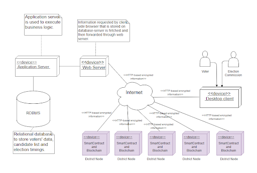

# E-Voting-Blockchain
Electronic Voting using Blockchain is a stable and secure alternative to ballot-based voting, utilising the key benefits of blockchain namely, decentralization, transparency and security. 

## Aim
The aim of the project was to utilize the three key properties of blockchain namely,
- Transparency: Each voter is given a registration id to confirm whether his/her vote has been accounted for 
in the blockchain.
- Decentralized: The blockchain is distributed across state nodes servers, hence having redundancy.
- Secure: The votes are unmodifiable. 

## Architecture Diagram

## Steps
### 1. Registration
1. The voter registers itself on the portal. 
2. A public, private key is generated for the user using RSA algorithm.
3. During this time, the user was contacting the centralized server. 
After the registration is successful, the server sends the IP address of the corresponding state node,
for direct interaction between the voter and the state node.

### 2. Voting
1. Each state node acts as a miner in the blockchain process. They all form a P2P network.
2. Once the connection between the voter and the state node is established, the state node sends a list of the candidates contesting from that state.
3. The voter, chooses its respective candidate, signs the transaction with the public key of state node server and sends it to the server.
4. The server decrypts the transaction using its private key, updates the database, encrypts the transaction using the public key of the voter.
5. All The transaction within 10 minutes, are added in the transaction pool for the state node server.

### 3. Mining
1. Once either the 10 mins have passed or the transaction pool becomes full for a state node, it sends out a broadcast of its transactions to other nodes.
2. Then, each node starts mining the block which will have these transactions.
3. The mining process is **Proof of Work (PoW)** which is as follows:
	- Each state node tries to generate the hash of the block based on the content of the block ie., timestamp, transactions, nonce, previous hash.
	- If the current hash satisfies a particular hexadecimal number, then the mining is said to be complete. Else, the nonce is incremented and the hash is again calculated.
	- Once  a node solves the problem, it sends out the mined block to others for verification, and adds the block to its own blockchain.
	- As and when each node verifies the block, they add the same to their own blockchain.

### 4. Confirmation of the vote
1. At the end of the process, each user is given a transaction id of the mapping of hash --> transaction id.
2. Using the transaction id and the private key of the user, it can check whether its vote has been accounted for in the blockchain.
3. This is transparency from the voters' perspective.

## Deployment Model

## Programming Languages
- Python
- JavaScript
- mySQL

## Libraries Used
- Flask
- requests
- cryptography
- hashlib

